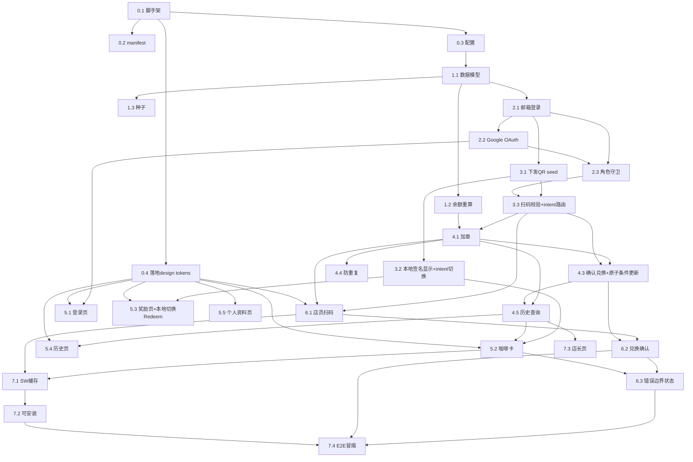
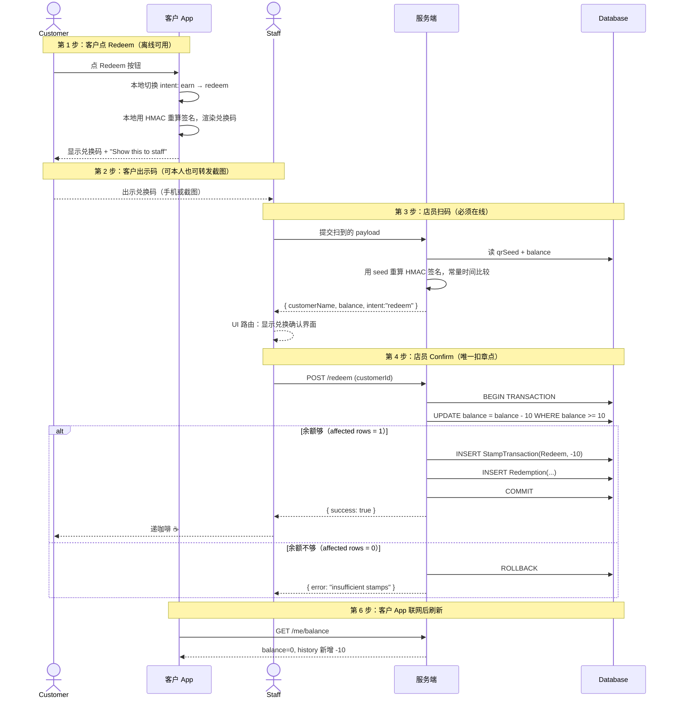

# BrewPoints — AI Agent 开发任务拆解

> 本文档把 `BrewPoints PDR V1.0` 拆解成适合 AI agent 逐步、可验证开发的任务清单。
> 每个任务都包含：**目标 / 依赖 / 实现要点 / 验收标准（DoD）**。
> agent 应**按阶段顺序**完成，每个任务结束后跑该任务的验收测试再进入下一个。

---

## 0. 给 Agent 的总体执行说明（先读这一节）

**工作方式约定：**
1. 每完成一个任务，运行其"验收标准"中的测试/检查，**全部通过后再进入下一个任务**。
2. 每个任务的代码改动应当是一次小的、可回滚的提交（建议 `feat(scope): ...` 风格 commit）。
3. 遇到 PDR 中标注 `> Note` / `> Design note` 的设计约束（尤其是积分扣减、QR token、StampBalance 缓存这三处），**必须严格遵守**，不要"自作主张简化"。
4. 不确定时，优先实现 PDR 明确写出的规则；扩展功能（推送、报表）放到最后或留空接口。

**推荐技术栈（可替换，但需保持等价能力）：**
| 层 | 选型 | 理由 |
|---|---|---|
| 前端 | React + Vite + TypeScript | 轻量，PWA 插件成熟 |
| PWA | `vite-plugin-pwa`（Workbox） | 自动生成 manifest + service worker |
| 状态 | React Context / Zustand | 小项目够用 |
| 后端 | Node + Express + TypeScript | 简单、与前端同语言 |
| 数据库 | SQLite + Prisma ORM | 零运维，符合"小店简单"定位 |
| 认证 | Google OAuth 2.0 + 邮箱密码(bcrypt) | 对应 PDR 8.1 |
| QR | `qrcode`(渲染) + `html5-qrcode`(扫描) + 标准 HMAC-SHA256 | 客户端本地用 seed 算长效签名 + 摄像头扫描 |

**三条不可违背的核心业务规则（贯穿全程）：**
- **R1｜扣章唯一入口**：积分扣减**只能**发生在"店员确认兑换"那一步（PDR 8.6 Stage 2 / User Story 4）。客户端**永不**扣章。
- **R2｜真相源**：`StampTransaction` 交易表是余额真相源，`Customer.StampBalance` 只是缓存；二者冲突时以交易表重算为准（PDR 16.1 Note）。
- **R3｜QR 真伪 + 余额是唯一关卡**：会员二维码客户端本地用 **per-customer seed 计算长效 HMAC 签名**生成（离线可用，签名只要 seed 不变就长期有效）。服务端扫码时仅做两件事：用同一 seed 重算签名验真伪（防伪造）+ 检查余额是否够扣。**不做时间窗口校验、不做防转发、不做"已用 token"记录**——本方案明确允许客户截图/转发二维码给家人朋友使用，任何时间扫都有效（积分是客户的资产，参考星巴克可让他人代点）。同一二维码被使用多次时，由"每次扣章前校验余额"和"扣章使用原子条件更新"共同保证账户永不出现负余额或并发双扣（PDR 8.3 / 9.3）。

---

## 阶段 0 — 项目脚手架与基建

### 任务 0.1 初始化 monorepo / 前后端骨架
- **目标**：创建可启动的空前端 + 空后端。
- **依赖**：无。
- **实现要点**：
  - 目录结构：`/client`(前端)、`/server`(后端)、根 `README.md`。
  - 前端 Vite + React + TS，后端 Express + TS，各自能 `dev` 启动。
  - 配置 ESLint + Prettier + tsconfig（strict 模式）。
  - 前端通过 `vite.config` 代理 `/api` 到后端端口。
- **验收标准（DoD）**：
  - [ ] `client` 启动后浏览器显示占位首页。
  - [ ] `server` 启动后 `GET /api/health` 返回 `{status:"ok"}`。
  - [ ] lint 与 typecheck 无报错。

### 任务 0.2 PWA manifest 占位
- **目标**：放入符合 PDR 17.1 的 manifest，色彩与 Wellington Espresso 设计系统一致（覆盖 PDR 17.1 中默认的棕色 `#6F4E37`）。
- **依赖**：0.1。
- **实现要点**：
  - 使用 PDR 17.1 给出的字段，但色彩按附录 D 设计系统替换：
    - `name`: "BrewPoints"
    - `short_name`: "BrewPoints"
    - `start_url`: "/"
    - `display`: "standalone"
    - `theme_color`: `#1A1A1A`（`--bp-ink`，覆盖 PDR 默认的 `#6F4E37`）
    - `background_color`: `#F5F1EA`（`--bp-paper`，覆盖 PDR 默认的 `#FFFFFF`）
  - 放置 192 / 512 应用图标（按附录 D.6 设计的 koru-bean 标识，黑底米色线条变体）。
- **验收标准**：
  - [ ] Chrome DevTools → Application → Manifest 正确解析，无错误。
  - [ ] theme/background 色与 `--bp-ink` / `--bp-paper` token 完全一致。

### 任务 0.4 落地设计系统 tokens（必须先于任何 UI 任务）
- **目标**：在仓库中放置可机读的设计 token 文件，让后续阶段 5 / 6 的 UI 任务直接 import，不需要从附录 D 文档抄数值。
- **依赖**：0.1。
- **实现要点**：
  - 在仓库 `/design/` 目录下放置三个文件（附录 D.9 提供的源文件）：
    - `brewpoints-tokens.css`（纯 CSS 变量 + `.bp-*` 组件类）
    - `tailwind.config.js`（Tailwind 主题扩展）
    - `component-snippets.md`（每个组件在 Tailwind / CSS 两种写法下的可粘贴代码）
  - 客户端根据技术栈接入其中一个：
    - 使用 Tailwind 项目：在客户端 `tailwind.config.js` 中 `presets: [require('./design/tailwind.config.js')]`
    - 不使用 Tailwind 项目：在入口 HTML / 全局样式中 `import './design/brewpoints-tokens.css'`
  - **不允许在业务组件中写死颜色 hex**（如 `style="background:#1A1A1A"`），必须通过 token 引用（`bg-bp-ink` 或 `var(--bp-ink)`）。
  - 同步落地 D.6 的 koru-bean SVG 标识到 `/design/assets/`（4 个色彩变体），App icon、splash、登录页 Logo 引用此处。
- **验收标准**：
  - [ ] `/design/` 目录三个文件就位，与项目同提交。
  - [ ] 前端能够通过 utility class 或 CSS 变量访问到所有 token（用一个示例组件验证 `bg-bp-paper text-bp-ink` 渲染正确）。
  - [ ] 全仓库代码搜索 `#1A1A1A` / `#F5F1EA` / `#C44A1F` 等品牌色，**业务代码中应为零结果**（仅 token 文件中出现）。

### 任务 0.3 环境配置与密钥管理
- **目标**：集中管理配置，避免硬编码。
- **依赖**：0.1。
- **实现要点**：
  - `.env.example` 列出：`DATABASE_URL`、`GOOGLE_CLIENT_ID/SECRET`、`JWT_SECRET`、`STAMPS_FOR_FREE_COFFEE=10`。
  - **不要**把真实密钥写入仓库；OAuth 凭据由人类用户自行创建并填入。
- **验收标准**：
  - [ ] 配置通过类型安全的 config 模块读取，缺失时启动报清晰错误。

---

## 阶段 1 — 数据模型与数据库层

### 任务 1.1 定义数据模型（PDR 第 16 节）
- **目标**：建立 Customer / Staff / Redemption / StampTransaction 四张表。
- **依赖**：0.3。
- **实现要点**（严格对应 PDR 16.1–16.4 字段）：
  - **Customer**：`CustomerId, Name, Email(唯一), Phone(可空), AuthProvider("google"|"email"), PasswordHash(google时为空), StampBalance(int,缓存), MembershipId(唯一), CreatedAt`。
    - **不实现 PDR 原表中的 `RewardRequested` 字段**：本项目采用"一段式兑换"（见阶段 4 设计说明），意图直接编码进二维码 payload 的 `intent` 字段，无需服务端意图标志。
    - **实现新增字段** `QrSeed`(string)：HMAC 签名密钥，仅服务端存储与使用，不在 PDR 原表中，因离线 QR 方案而引入（见阶段 3）。
  - **Staff**：`StaffId, Name, Email, Role, CreatedAt`。
  - **Redemption**：`RedemptionId, CustomerId, StaffId, RewardName, StampsUsed, RedeemedAt`。
  - **StampTransaction**：`TransactionId, CustomerId, StaffId, StampValue(可正可负), TransactionType("Earn"|"Redeem"|"Adjustment"), Note, CreatedAt`。
  - 设置外键关系（Customer 1→N StampTransaction / Redemption）。
- **验收标准**：
  - [ ] 迁移成功生成数据库。
  - [ ] 四张表字段、类型、可空性与 PDR 完全一致。

### 任务 1.2 余额重算函数（落实 R2）
- **目标**：实现"从交易表重算余额"的权威函数。
- **依赖**：1.1。
- **实现要点**：
  - `recalculateBalance(customerId)` = `sum(StampTransaction.StampValue)`。
  - 提供 `getBalance(customerId)`：默认读缓存 `StampBalance`，但暴露一致性校验工具，必要时用重算值修正缓存。
- **验收标准**：
  - [ ] 单测：插入 +1,+1,+1,-10... 系列交易后，重算值正确。
  - [ ] 单测：手动篡改缓存后，调用一致性校验能检出并修正。

### 任务 1.3 种子数据
- **目标**：可一键插入测试用 staff + customer。
- **依赖**：1.1。
- **验收标准**：
  - [ ] 运行 seed 后，存在 ≥1 个 staff 账号、≥2 个不同状态(余额 6/余额 10)的 customer，便于后续手测。

---

## 阶段 2 — 认证模块（PDR 8.1 / 15.2 / 9.3）

### 任务 2.1 邮箱+密码 注册/登录
- **目标**：实现 PDR 8.1 第 2 种方式。
- **依赖**：1.1。
- **实现要点**：
  - 注册：Name(必填,可为昵称) / Email(必填,唯一) / Phone(可空) / Password。
  - 密码用 **bcrypt 哈希存储**，绝不存明文（PDR 9.3 安全红线）。
  - 登录返回会话凭证（JWT 或 session）。
  - 新建 customer 时生成唯一 `MembershipId`（如 `BP-10001`）。
- **验收标准**：
  - [ ] 注册后数据库 `PasswordHash` 为哈希、非明文。
  - [ ] 错误密码登录被拒绝。
  - [ ] Phone 留空仍可成功注册。

### 任务 2.2 Google OAuth 2.0 登录/注册
- **目标**：实现 PDR 8.1 第 1 种方式（真实 OAuth 流程，对应时序图 15.2）。
- **依赖**：2.1。
- **实现要点**：
  - 标准授权码流程：前端跳转 Google 同意屏 → 回调换取 profile(name,email)。
  - **同一按钮兼顾注册与登录**：按 email 查无账号则自动建号(`AuthProvider="google"`, 无密码)，有则直接登录。
  - 只请求基础 profile(name,email)，**不接触 Google 密码**。
- **验收标准**：
  - [ ] 首次 Google 登录自动建号且 `PasswordHash` 为空。
  - [ ] 二次 Google 登录直接登入同一账号（不重复建号）。
- **注意**：OAuth Client 凭据需人类用户在 Google Cloud Console 自行创建并填入 `.env`；agent 不代为创建账号或填入真实密钥。

### 任务 2.3 角色与路由守卫
- **目标**：区分 customer / staff，保护变更余额的接口。
- **依赖**：2.1, 2.2。
- **实现要点**：
  - 落实 PDR 9.3：**只有已登录 staff** 能调用加章/兑换接口。
  - 中间件校验角色，未授权返回 401/403。
- **验收标准**：
  - [ ] customer 凭证调用加章接口被拒绝。
  - [ ] staff 凭证可访问 staff 接口。

---

## 阶段 3 — 动态 QR 码模块（PDR 8.3 / 9.3，落实 R3）

> **设计方案：客户端离线本地生成（长效 HMAC 签名）+ 服务端扫码验签 + 二维码 payload 携带 `intent` 表达用途。**
> 关键区分：**客户"出示"码可完全离线**（手机没网也能展示，且加章 / 兑换都可以离线发起）；**店员"扫码校验"必须在线**（验签名、读余额、写余额都要服务端）。
>
> **长效 HMAC 签名（不滚动时间窗口）**：登录时服务端给该客户下发一个**专属密钥 seed**，客户端用 `HMAC-SHA256(seed, membershipId + "|" + intent)` 算出一个签名，组装 payload `{ membershipId, intent, signature }`。**签名只要 seed 不变就长期有效**——客户截图发给妈妈，妈妈一周后扫也能用。这是产品决策"允许转发/代领"的直接落实（参考星巴克可让他人代点）。如果担心 seed 泄漏，可在客户下次登录时刷新 seed（旧 seed 作废，所有旧截图失效）——V1 不强制实现该重置功能，但数据模型需支持 seed 可更新。
>
> **payload 携带 `intent` 字段**：二维码包含 `{ membershipId, intent, signature }`，其中 `intent ∈ {"earn", "redeem"}`。`earn` 是日常出示给店员加章用的码（默认显示）；`redeem` 是客户点 `Redeem` 按钮后切换出来的兑换码，意图随码一起被店员"取走"，**完全无需联网告知服务端**。
>
> **为什么不用 TOTP/时间窗口**：30 秒滚动的设计目标是防"路人偷拍截图再用"，但本项目已明确允许转发——防御目标不存在了，再保留时间窗口反而会让代领体验失败（妈妈拿到截图过几分钟才到店，码已经过期）。账户安全性由"余额校验 + 原子更新"在阶段 4.3 兜底，而非依赖二维码不可转发。

### 任务 3.1 登录时下发 per-customer QR seed
- **目标**：为每个客户生成并安全下发一个 HMAC 签名密钥 seed。
- **依赖**：2.1。
- **实现要点**：
  - 客户首次创建账号时，服务端生成一个高熵随机 `qrSeed`（如 32 字节 base32），存入服务端（与 Customer 关联，**不入二维码、不下发给店员端**）。
  - 客户**登录成功后**，将 `qrSeed` 连同 `membershipId` 一并下发给该客户的设备，客户端存于本地（如 IndexedDB；避免放在易被脚本读取的位置）。
  - seed 仅用于本地计算 QR 签名，**绝不含密码或个人信息**。
  - 数据模型支持 seed 可更新（便于未来加"重置我的二维码"功能让旧截图失效），V1 不强制实现该重置 UI。
- **验收标准（DoD）**：
  - [ ] 新客户在数据库中拥有唯一 `qrSeed`。
  - [ ] 登录响应中包含 `qrSeed + membershipId`，且**不包含**任何密码字段。
  - [ ] 二维码 payload 中**不含** seed（只含 membershipId + intent + signature）。

### 任务 3.2 客户端本地 HMAC 签名生成 + QR 显示组件（离线可用）
- **目标**：PDR 14.2 的会员码区，**断网也能用**。同一组件支持两种 `intent`：日常加章码（earn）与兑换码（redeem）。
- **依赖**：3.1。
- **实现要点**：
  - 用本地 `qrSeed` 通过标准 HMAC-SHA256 算法对 `membershipId + "|" + intent` 计算签名，组装 payload `{ membershipId, intent, signature }`。
  - **签名是确定性的**：只要 seed、membershipId、intent 不变，每次算出的签名一样。**不引入时间窗口、不滚动**——这是允许转发代领的关键。
  - **默认 `intent="earn"`**（咖啡卡页常驻显示的会员码）。**当客户余额 ≥ 10 并主动点 `Redeem` 时切换 `intent="redeem"`** 重新渲染同一二维码组件（见任务 5.3）。两种模式都纯本地计算，无任何网络请求。
  - 用 `qrcode` 库渲染。**不需要倒计时、不需要定时刷新逻辑**——签名长期有效。
- **验收标准**：
  - [ ] **断网状态下**仍能显示二维码。
  - [ ] **断网状态下**点 `Redeem` 可成功切换到 `intent="redeem"` 的兑换码（不发任何请求）。
  - [ ] 二维码 payload 仅含 membershipId / intent / signature，无 seed、无敏感信息。
  - [ ] 同一 (membershipId, intent) 多次生成的二维码完全一致（确定性验证）。

### 任务 3.3 服务端扫码校验接口（在线）
- **目标**：店员扫码后**仅校验签名真伪**并返回客户信息 + intent，由前端根据 intent 进入对应操作流程。**Network Only，不可离线。**
- **依赖**：3.1, 2.3。
- **实现要点**：
  - 解析 payload `{ membershipId, intent, signature }` → 用该 membershipId 对应的服务端 `qrSeed` 重算 `HMAC-SHA256(seed, membershipId + "|" + intent)` → 与扫到的 signature 用**常量时间比较**（防 timing attack）。命中则有效。
  - **不维护"已用 token"记录、不做时间窗口校验**：本项目允许同一码被多次/多人使用、允许在任意时间扫码。单次使用约束由"每次扣章前校验余额"在阶段 4.3 兜底（同一码用多次的结果就是把余额一杯一杯扣到不够为止，自然停止）。
  - 签名校验失败（伪造、payload 被篡改、或客户已重置 seed 导致旧码失效）：返回 "invalid code, ask customer to refresh from their app"。
  - 签名校验成功：返回 `{ customerName, stampBalance, intent }`。前端按 `intent` 路由：`"earn"` → 显示加章按钮（任务 6.1）；`"redeem"` → 显示兑换确认按钮（任务 6.2）。
  - 接口标注 **Network Only**：Service Worker 不得缓存此接口，断网时由前端给出"需联网"提示（见阶段 7）。
- **验收标准**：
  - [ ] 签名正确的 payload 校验通过并返回正确的 customerName / stampBalance / intent。
  - [ ] 签名被篡改（任何 1 个字节改动）的 payload 校验失败。
  - [ ] `intent="earn"` 与 `intent="redeem"` 的两种码扫码后返回的响应能让前端正确路由到不同界面。
  - [ ] 签名比较使用常量时间比较函数（如 `crypto.timingSafeEqual`），不用 `===`。

---

## 阶段 4 — 积分核心逻辑（LoyaltyService，落实 R1 / R2）

> **设计：一段式兑换。** 客户想兑换 → 本地切换显示兑换码（intent="redeem"，离线可用，见 5.3）→ 出示给店员 → 店员扫码后系统识别 intent → 店员点 Confirm → 服务端扣章。**全流程没有"客户请求标志"，意图直接编码进二维码。**
>
> 这是全项目业务最关键的部分。务必严格遵守"扣章唯一入口"。

### 任务 4.1 加章接口（+1 / +2）
- **目标**：PDR 8.4 / 8.5 / User Story 2。
- **依赖**：3.3, 1.2。
- **实现要点**：
  - staff 鉴权后，对指定 customer 写入 `StampTransaction(type="Earn", value=+1 或 +2)` 并更新缓存余额。
  - 规则：1 杯=1 章。每次操作都落一条交易记录（PDR 8.7 / 9.4）。
- **验收标准**：
  - [ ] +1 后余额 +1 且新增一条 Earn 交易。
  - [ ] +2 一次操作新增对应交易、余额 +2。
  - [ ] 非 staff 调用被拒。

### 任务 4.3 店员确认兑换接口（唯一扣章点）
- **目标**：PDR 8.6 Stage 2 / User Story 4 / 时序图 15.4 的一段式版本。
- **依赖**：4.1, 3.3。
- **实现要点**：
  - 触发路径：店员扫到 `intent="redeem"` 的码 → 前端显示"兑换 1 杯免费咖啡，余额 X/10"→ 店员点 `Confirm` → 调用本接口。
  - **必须使用原子条件更新**避免并发双扣，例如：
    ```sql
    UPDATE Customer SET StampBalance = StampBalance - 10
    WHERE CustomerId = ? AND StampBalance >= 10
    ```
    检查 affected rows = 1 才算成功；= 0 则返回"余额不足"。**不能**先 SELECT 余额再写——两条 SQL 之间存在竞态窗口，并发请求可能都通过校验、都执行扣章导致余额为负。
  - 在**同一事务内**完成四件事：原子条件扣 10 章 + 写 `StampTransaction(type="Redeem", value=-10)` + 写 `Redemption` 记录 + 提交。任一失败全部回滚（R2：余额与历史始终一致）。
  - 余额不足：返回明确的差额提示，不写任何记录。
  - 成功：返回新的余额 + redemptionId。
- **设计意图（请阅读，避免误改）**：
  - **允许同一兑换码被使用多次**：客户截图发给妈妈，妈妈扫了扣 10 章后，客户自己再用同一截图扫——服务端发现余额已不足，自然拒绝。**这是 feature，不是 bug**，是 R3 "允许转发"的体现。
  - **允许积分多的客户连续兑换**：客户余额 30，妈妈拿一张截图连续扫三次，每次扣 10、扣到 0 才停——这是合理的"代领多杯"场景，符合产品决策。
  - **绝不会出现负余额**：原子条件 `WHERE balance >= 10` 在数据库层保证，无论并发多少次请求。
- **验收标准**：
  - [ ] 余额 10 时兑换：余额变 0、新增 1 条 Redeem 交易、新增 1 条 Redemption——**三者在同一事务**。
  - [ ] 余额 9 时兑换被拒，无任何写入。
  - [ ] **并发测试**：同时发起 2 个相同兑换请求（余额 10），只有 1 个成功、1 个被拒，余额最终为 0，绝不为 -10。
  - [ ] **多次扫同一码**：余额 30 时连扫 3 次成功，第 4 次因余额不足被拒，余额最终为 0。
  - [ ] 全程客户端从未触发任何扣章（审查接口调用确认）。

### 任务 4.4 防重复加章（PDR 9.4）
- **目标**：操作层面避免重复盖章。
- **依赖**：4.1。
- **实现要点**：加章成功后返回确认，前端 `+1` 按钮短暂禁用（冷却）；后端可选幂等保护。
- **验收标准**：
  - [ ] 连续快速双击只产生一条 Earn 交易（或前端按钮在冷却内不可再点）。

### 任务 4.5 交易/兑换历史查询接口
- **目标**：PDR 8.7 / 14.5。
- **依赖**：4.1, 4.3。
- **验收标准**：
  - [ ] 返回客户的交易列表（含类型、值、时间）。
  - [ ] 返回客户的兑换历史（Redemption 列表）。

---

## 阶段 5 — 客户端界面（PDR 14 / 12 客户流）

### 任务 5.1 登录/注册页（14.1）
- **依赖**：2.1, 2.2, 0.4。
- **实现要点**：`Continue with Google` 按钮 + 邮箱表单（Phone 标注 optional）；同页处理注册与登录。**视觉与文案严格遵循附录 D**，对应 D.7.1 屏幕：使用 `bp-card` 表单组、Google 按钮用 `bp-btn--primary`、邮箱登录按钮用 `bp-btn--secondary`、Phone 字段提示 "Phone is optional — we ask nothing you don't want to share"。
- **验收标准**：
  - [ ] 两种登录方式均可走通并跳转到咖啡卡页。
  - [ ] 视觉对照附录 D.7.1 mockup，关键元素（Logo、按钮、副标题语调）一致。

### 任务 5.2 数字咖啡卡首页（14.2 / User Story 1）
- **依赖**：3.2, 4.5, 0.4。
- **实现要点**：显示问候语、`X / 10 Stamps`、**Koru 螺旋进度可视化**（附录 D.4.7）、会员 QR 码区（intent=earn，调用任务 3.2 组件）、底部导航(Home/Rewards/History/Profile)。移动端友好。**不显示倒计时或"Refreshes in Xs"文案**——本方案 QR 长期有效，PDR 14.2 线框中那行倒计时不实现。对应附录 D.7.3（攒章中）和 D.7.4（满章可兑）两种状态：满章时整卡反色为 `bp-ink` 底，所有 10 颗豆变 `bp-fern-bright`，角标变 `bp-clay`，并出现 `bp-btn--redeem` 按钮。问候文案使用 "Morning, [name]." 而非 "Welcome back"。
- **验收标准**：
  - [ ] 余额、进度、QR 正确显示；移动视口下排版正常；无倒计时元素。
  - [ ] Koru 螺旋而非线性进度条（区别于奖励页）。
  - [ ] 满章状态触发完整反色 + clay 按钮 + 副标题切换为 "Your shout's on us"。

### 任务 5.3 奖励页（14.3 / User Story 3 入口）
- **依赖**：3.2, 4.5, 0.4。
- **实现要点**：显示当前进度卡（使用**附录 D.4.6 的 10 段进度条**而非 Koru，区分于咖啡卡）；满 10 枚时出现 `Redeem` 按钮，**点击后纯客户端切换**当前 QR 组件的 intent 从 "earn" 到 "redeem"（调用任务 3.2 的组件），无网络请求；显示已兑换历史（"Your shouts so far" 作为标题）。对应附录 D.7.5。
- **验收标准**：
  - [ ] 不足 10 枚显示 "Not available yet"，`Redeem` 按钮不可见。
  - [ ] 满足时点击 `Redeem` **在断网状态下也能成功切换显示兑换码**。
  - [ ] 兑换码与日常会员码视觉上可区分（如不同标题/颜色/标签）。
  - [ ] 文案不含 "Redeemed"，强调"出示给店员"。
  - [ ] 已兑换列表显示具体咖啡种类 + 店名（如 "Flat white · Karangahape Rd"），日期用 Georgia 斜体。

### 任务 5.4 历史页（14.5）
- **依赖**：4.5, 0.4。
- **实现要点**：对应附录 D.7.6。按周分组（"This week" / "Last week"，斜体小字），每条历史记录显示具体咖啡名（"Latte" / "Flat white" / "Two flat whites"）+ 时间。**+1/+2 用 `bp-fern` Georgia 斜体；−10 用 `bp-clay` Georgia 斜体**，左侧圆形图标对应区分（加号 vs 减号、米色 vs 浅赤陶圈）。
- **验收标准**：[ ] 按时间倒序展示 +1 / -10 等交易；数字、颜色、图标按附录 D 规范。

### 任务 5.5 个人资料页
- **依赖**：2.1, 0.4。
- **实现要点**：对应附录 D.7.7。顶部 `bp-ink` 黑色统计卡显示累计 cups / 已兑 free / 当前 stamps 三个 Georgia 斜体数字。Phone 字段未填写时显示 **"Not added — that's fine"** 而非 "Add phone number"。Sign out 用 `bp-btn--ghost`（小字、底部居中、不强调）。
- **验收标准**：
  - [ ] 显示 name/email/phone，提供登出。
  - [ ] Phone 字段文案为正面肯定（按附录 D.5）。

---

## 阶段 6 — 店员端界面（PDR 14.4 / 12 店员流）

### 任务 6.1 店员扫码页（14.4 / User Story 2）
- **依赖**：3.3, 4.1, 0.4。
- **实现要点**：摄像头扫码（`html5-qrcode`）→ 调用 3.3 拿到 `{customerName, stampBalance, intent}` → **根据 intent 路由 UI**：
  - `intent="earn"`（日常会员码）：对应附录 D.7.9。显示 `+1 Stamp` / `+2 Stamps` 按钮 + 客户姓名 + 当前余额 + 10 段进度条。**+1 主按钮黑底,+2 次按钮白底黑描边**;数字 +1/+2 用 Georgia 斜体大字。整页无 `bp-clay` 出现（加章场景禁用赤陶）。
  - `intent="redeem"`（兑换码）：见任务 6.2。
- 扫到过期/无效码显示对应附录 D.7.13 错误状态（赤陶圈 + "Couldn't read that code" + Try again）。
- **验收标准**：
  - [ ] 扫 `intent="earn"` 的有效码显示客户信息和加章按钮，整屏无赤陶色出现。
  - [ ] `+1`/`+2` 即时更新余额并提示成功。
  - [ ] 扫过期/无效码显示明确提示，不进入操作面板。

### 任务 6.2 兑换确认交互（User Story 4）
- **依赖**：6.1, 4.3, 0.4。
- **实现要点**：扫到 `intent="redeem"` 的码 → 对应附录 D.7.10 + 兑换前面的 mockup：
  - 顶部**黑色高亮条**（`bp-ink` 底）显示 "Redemption request · Customer wants their free coffee"，五角星填充 `bp-clay`——这是 intent 路由的视觉信号。
  - 客户信息卡显示姓名 + Member since 日期 + 余额 `10/10`（绿色 Georgia 斜体）+ 满 10 段进度条。
  - "Reward" 卡显示 "One free regular coffee" + 副标题 "Flat white, long black, latte, cappuccino" + 右侧 `-10` Georgia 斜体赤陶色。
  - `Confirm Redemption` 主按钮（`bp-btn--redeem` 赤陶色）。
  - 若余额不足：按钮禁用，显示差额（"Need X more stamps"），整屏无赤陶（按附录 D.7.14 边界状态规范）。
- 兑换成功后显示附录 D.7.16 反馈：黑底 + 赤陶高光圈 + Koru 水印 + "Cheers — coffee's on the house"。
- **验收标准**：
  - [ ] 扫到兑换码的客户在 UI 上有明显的兑换语义高亮（顶部赤陶 banner）。
  - [ ] 余额够：点 Confirm 后余额、历史同步更新，显示带 Koru 水印的成功反馈。
  - [ ] 余额不够：按钮禁用，显示差额，整屏无赤陶色出现（区分于"可兑换"状态）。

### 任务 6.3 错误与边界状态实现（贯穿 6.1 / 6.2 / 客户端）
- **依赖**：5.1–5.5, 6.1, 6.2 基本完成。
- **实现要点**：实现附录 D.7.11–D.7.16 六个边界状态：
  - **D.7.11 客户离线提示条**：黑色 banner 顶部置入咖啡卡页面，文案 "You're offline · your QR still works"——安抚语气，**不报警**。
  - **D.7.12 加章成功反馈**：店员加章后客户端短暂浮层（或 toast），显示当前 `7 of 10` Georgia 斜体 + "Three more cups till the next one's on us"。
  - **D.7.13 扫码失败**：赤陶圈 + × + "Couldn't read that code" + "Try again" 按钮。
  - **D.7.14 余额不足**：店员扫到 redeem 码但余额 < 10 时,客户卡正常显示,**底部加米色信息条** "Not quite there yet. X more stamps needed for a free coffee."——**不用红色、不用大叉号**。
  - **D.7.15 店员设备断网**：全屏黑底 + 断网图标 + "Can't reach BrewPoints" + Retry 按钮——阻断状态、视觉权重最高。
  - **D.7.16 兑换成功反馈**：黑底 + 赤陶高光 + Koru 水印 + "Cheers — coffee's on the house"。
- **验收标准**：
  - [ ] 六个状态全部实现并能在测试环境中触发。
  - [ ] 文案、配色、图标完全对照附录 D.7 mockup，无变体或简化。

---

## 阶段 7 — PWA 化与收尾

### 任务 7.1 Service Worker 与离线缓存策略（PDR 17.2）
- **依赖**：5.x, 6.x 基本完成。
- **实现要点**：用 Workbox 按下表为不同资源/接口配置缓存策略。核心原则：**读可离线，所有改余额的写 + 扫码校验必须 Network Only**。

  | 资源 / 接口 | 策略 | 离线行为 |
  |---|---|---|
  | App Shell、JS/CSS、图标、字体、manifest | **Cache First** | 离线秒开（PDR 17.2/17.3） |
  | 客户咖啡卡数据（余额、进度，只读快照） | **Stale-While-Revalidate** | 先显示缓存旧值 + 标注"上次更新于 X"，联网后台刷新 |
  | 交易历史 / 兑换历史（只读） | **Stale-While-Revalidate** | 历史不可变，缓存离线查看 |
  | 奖励规则、静态文案 | **Cache First** | 离线可见 |
  | **客户动态 QR 显示（earn 码 + redeem 码）** | **本地计算，无网络依赖** | **离线完全可用**（阶段 3 长效 HMAC 签名，签名长期有效不需要刷新） |
  | **客户从会员码切换到兑换码（点 Redeem）** | **纯前端 intent 切换** | **离线完全可用**，无需服务端介入 |
  | **店员扫码校验接口（3.3）** | **Network Only** | 断网时前端提示"需联网才能扫码" |
  | **店员加章 / 兑换、所有写余额接口（4.1/4.3）** | **Network Only** | 断网时明确提示"需联网才能完成此操作"，不静默失败、不用旧数据 |
  | 登录 / OAuth 接口 | **Network Only** | 断网无法登录 |

- **验收标准**：
  - [ ] 断网后 app shell、咖啡卡（旧快照）、历史页可加载。
  - [ ] **断网后客户两种 QR 都可显示、可切换**（验证 3.2 + 5.3 离线可用）。
  - [ ] 断网时店员扫码 / 加章 / 兑换给出明确"需联网"提示，**不会**用缓存数据伪造成功。
  - [ ] 只读快照页面标注数据时效（"上次更新于…"）。
  - [ ] Lighthouse PWA 项通过 installable 检查。

### 任务 7.2 可安装性验证（PDR 17.3）
- **依赖**：7.1, 0.2。
- **验收标准**：[ ] 移动端浏览器可"添加到主屏幕"，以独立窗口启动。

### 任务 7.3 店长查看页（PDR 5.3，最小实现）
- **依赖**：4.5。
- **实现要点**：只读列表：基础客户忠诚度信息、积分交易、兑换记录。
- **验收标准**：[ ] 店长可查看上述三类只读数据。

### 任务 7.4 端到端冒烟测试
- **依赖**：全部。
- **实现要点**：按 PDR 13 故事板（已按一段式调整）跑通：注册→显示会员码→店员扫码 +1×10→客户点 Redeem 本地切换到兑换码→店员扫兑换码→识别为 redeem→店员 Confirm 扣 10→历史出现 -10 与一条 Redemption。
- **额外测试场景**（验证最终设计）：
  - **离线兑换发起**：客户断网点 Redeem，本地成功切换到兑换码（不发请求）；重新联网后到店扫码可正常完成兑换。
  - **截图转发**：客户截图兑换码发给另一台设备使用，扫码可成功兑换（验证"允许转发"产品决策落实）。
  - **并发双扣**：用脚本同时打两个相同兑换请求，结果仅一个成功、余额最终为 0 不为 -10。
- **验收标准**：
  - [ ] 整条 happy path 全程通过。
  - [ ] 上述三个额外场景全部通过。
  - [ ] 验证 R1/R2/R3 三条红线在全流程未被破坏。

---

## 附录 A — 任务依赖关系图



---

## 附录 B — 红线自查清单（每阶段结束核对）

- [ ] **R1**：是否存在任何客户端直接扣减余额的代码路径？必须为否。
- [ ] **R2**：扣章是否与 Redeem 交易、Redemption 记录在同一事务写入？余额能否由交易表重算得出？扣章是否使用了 `UPDATE ... WHERE balance >= 10` 这类**原子条件更新**（而非"先 SELECT 再 UPDATE"），并发请求测试不会产生负余额？
- [ ] **R3**：客户端两种 QR（earn / redeem）是否都纯本地用 HMAC 签名生成（离线可用）且 payload 绝无 seed/敏感信息？服务端扫码校验是否只做"用 seed 重算签名验真伪"而**没有**维护"已用 token"表、**没有**做时间窗口校验（均已弃用）？签名比较是否使用常量时间比较？扫码校验接口是否 Network Only？
- [ ] 密码是否仅以哈希存储？
- [ ] 变更余额的接口是否仅 staff 可调用？

---

## 附录 C — 兑换免费咖啡：完整业务流程

> **本附录是兑换流程的权威说明，与 PDR 8.6 的两段式版本相比已重新设计。** 凡阶段 4/5/6 的实现细节与本附录冲突时，以本附录为准。

### C.1 设计决策摘要

| 决策点 | 选择 | 与 PDR 原方案的区别 |
|---|---|---|
| 兑换流程结构 | **一段式**：客户切换码 → 店员扫 → 店员确认扣章 | PDR 原为两段式（请求 + 确认） |
| 客户意图如何传达 | **编码进二维码 payload 的 `intent` 字段** | PDR 原用服务端 `RewardRequested` 标志 |
| 客户离线能否发起兑换 | **能**（纯前端切换 intent） | PDR 原方案"请求"步骤需联网 |
| 是否允许截图转发兑换码 | **允许**（积分是客户资产） | PDR 隐含"必须本人到店" |
| 同一码被使用多次怎么办 | **由余额校验自然挡住**（不够就拒绝） | PDR 原依赖服务端"已用 token"防重放 |
| 一次性多杯兑换 | **不专门支持**，但可连续扫码逐杯扣 | 与 PDR 一致 |
| 扣章在哪发生 | **仅店员扫码 + Confirm 那一刻**（R1 不变） | 与 PDR 一致 |

### C.2 角色与状态

- **客户 App** 持有：登录态 + 本地 `qrSeed` + 当前 UI 选择的 `intent`（默认 `"earn"`）。
- **服务端** 持有：客户 `qrSeed`（用于验真）+ `StampBalance` 缓存 + `StampTransaction` 真相源 + `Redemption` 历史。
- **店员设备** 持有：登录态 + 在线扫码能力。

**没有任何"兑换请求中"的中间态**——客户的"想兑换"只是 App 本地 UI 状态，不持久化到服务端。

### C.3 标准流程（happy path）

#### 第 1 步｜客户在 App 里点 Redeem

- 触发条件：客户的 `StampBalance ≥ 10`（前端用缓存判断，离线也行）。
- 客户在咖啡卡页或奖励页点 `Redeem` 按钮。
- **App 端动作**：把 QR 组件的 `intent` 从 `"earn"` 切换为 `"redeem"`，本地用 HMAC 重算签名，渲染兑换码。**纯前端，零网络请求**。
- 文案显示"Show this redemption QR to staff"，不出现"Redeemed"（兑换尚未完成）。
- 客户可点"返回会员码"切回 `intent="earn"`，无副作用。

#### 第 2 步｜客户出示兑换码

- 客户走到柜台，举起手机给店员看。可以本人到场，也可以发截图/转发给家人朋友代领——**两种都被允许，且无时间限制**（截图几天后扫也行，只要客户未重置 seed）。
- 二维码 payload：`{ membershipId, intent: "redeem", signature }`，签名是基于 qrSeed 的长效 HMAC，不滚动。

#### 第 3 步｜店员扫码

- 店员设备**必须在线**，调用扫码校验接口（任务 3.3）。
- 服务端用客户 `qrSeed` 重算 HMAC 签名（对 `membershipId + "|" + intent`），与扫到的 signature 做常量时间比较，返回 `{ customerName, stampBalance, intent: "redeem" }`。
- 前端识别 `intent="redeem"` → 路由到兑换确认界面（任务 6.2），UI 突出显示"客户要兑换 1 杯免费咖啡 · 余额 X/10"。
- 若签名校验失败（被篡改或客户已重置 seed 导致旧码失效）→ 提示客户从 App 重新打开二维码。

#### 第 4 步｜店员点 Confirm 完成兑换

- 仅当 `stampBalance ≥ 10` 时 `Confirm` 按钮可点。
- 店员点击 → 调用兑换接口（任务 4.3）。
- 服务端**在单个事务内**：
  1. 执行原子条件更新 `UPDATE Customer SET StampBalance = StampBalance - 10 WHERE CustomerId = ? AND StampBalance >= 10`。
  2. 检查 affected rows = 1（= 0 则余额不足，全事务回滚返回错误）。
  3. 写一条 `StampTransaction(type="Redeem", value=-10, StaffId=当前店员)`。
  4. 写一条 `Redemption(CustomerId, StaffId, RewardName="Free Regular Coffee", StampsUsed=10, RedeemedAt=now)`。
  5. 提交。
- 返回成功响应给店员设备。

#### 第 5 步｜店员把咖啡递给客户

- 店员看到 "Redemption successful"。
- **此时**把咖啡递给客户（系统动作与物理动作发生在同一时刻——这是 R1 设计的根本目的）。

#### 第 6 步｜客户 App 联网后自动刷新

- 咖啡卡余额变 0/10，进度条归零，奖励页"已兑换"列表新增一条，历史页新增一条 `-10 · Free coffee redeemed`。
- 若客户当时离线，下次联网时拉到新数据即可。

### C.4 边界场景与系统行为

| 场景 | 系统行为 | 是否符合设计 |
|---|---|---|
| 客户离线点 Redeem | 本地切换到兑换码，无网络请求 | ✅ |
| 客户截图发给妈妈，妈妈到店扫码兑换 | 服务端验签通过，扣 10 章，妈妈领到咖啡 | ✅（允许转发） |
| **客户上午截图、妈妈下午到店扫码** | 签名长期有效，正常兑换 | ✅（长效签名，无时间窗口限制） |
| 客户余额 30，妈妈连扫同一截图 3 次 | 第 1/2/3 次都扣 10 成功，第 4 次余额不足被拒 | ✅（自然支持多杯代领） |
| 妈妈先扫了扣 10，客户自己又拿同一截图去店里扫 | 服务端发现余额 = 0 < 10，拒绝；不产生负余额 | ✅（余额校验兜底） |
| 店员手滑连点两次 Confirm | 第 1 次扣 10 成功（原子条件更新），第 2 次余额 = 0 被拒 | ✅ |
| 网络抖动导致店员设备发了 2 个相同 Confirm 请求 | 数据库原子条件 `WHERE balance >= 10` 保证只有 1 个 UPDATE 命中 | ✅（无负余额） |
| 二维码被恶意篡改（修改 payload 字段） | 签名比对失败，扫码被拒 | ✅（HMAC 防伪造） |
| 客户点 Redeem 但又想取消 | 点"返回会员码"切回 intent=earn，无任何服务端记录需要清理 | ✅（无中间态） |
| 店员误把会员码当兑换码处理 | 扫码后服务端返回 `intent="earn"`，UI 自然路由到加章界面，不会误扣章 | ✅（intent 路由保护） |

### C.5 流程时序图



### C.6 与原 PDR 8.6 的对照（用于答辩 / 评审）

如果评审者按 PDR 原文检查"两段式兑换"，可参考以下对照说明：

- PDR 8.6 Stage 1 "客户请求"的**意图传达功能**：在本实现中由二维码 payload 的 `intent="redeem"` 字段承担，意图通过扫码直接传达给店员系统，不再需要服务端标志。
- PDR 8.6 Stage 1 "no deduction" 的约束：在本实现中同样满足——客户点 Redeem 只切换前端 UI 状态，不调用任何后端接口，余额毫无变化。
- PDR 8.6 Stage 2 "店员确认扣章"：完全保留，是本系统的唯一扣章入口（R1）。
- PDR User Story 3 中"可取消请求"的诉求：在本实现中由"返回会员码"按钮承担，因无服务端状态需清理，取消是天然零成本的。
- PDR Design note "no transferable redemption voucher to share"：**本实现明确反转此约束**，决策为允许转发（C.1 已记录决策依据：积分是客户资产）。账户安全性由"余额校验 + 原子更新"在数据正确性层面保证，而非依赖二维码不可转发。

---

## 附录 D — UI 设计系统：Wellington Espresso

> **设计目标**：让 BrewPoints 看起来像奥克兰 / 惠灵顿独立咖啡馆会用的东西，而不是套了棕色滤镜的通用 loyalty app。视觉语言来源于：未漂白咖啡滤纸、黑板手写菜单、毛利 koru 图腾、Allbirds / Air NZ 风格的极简对比。
>
> **关键原则**：克制 > 装饰；留白 > 元素；本土感 > 通用感。烧赤陶色全 App 只在"兑换/奖励就绪"出现，绝不稀释。

### D.1 色彩 tokens

```css
/* Surfaces */
--bp-paper:        #F5F1EA;  /* 主背景，牛皮纸米白 */
--bp-paper-warm:   #E8E2D5;  /* 屏幕外缘 / 分隔层 */
--bp-card:         #FFFFFF;  /* 卡片白底 */
--bp-card-border:  #E0DAC9;  /* 卡片描边，比 paper 深一档 */
--bp-divider:      #F0EBE0;  /* 卡片内分隔线，比 border 浅 */

/* Ink */
--bp-ink:          #1A1A1A;  /* 主文字 / 反色卡片底 / 主按钮 */
--bp-ink-soft:     #2A2A2A;  /* 黑卡内的次级表面 */
--bp-stone:        #8A8580;  /* 辅助文字 / 占位 / 暖灰 */
--bp-stone-light:  #D8D2C2;  /* 未激活进度条 / 分隔 */

/* Accents */
--bp-fern:         #2D5F4F;  /* 蕨绿，已盖章 / 进度 / +1 +2 数字 */
--bp-fern-bright:  #5DCAA5;  /* 亮蕨绿，满章状态高光 */
--bp-clay:         #C44A1F;  /* 烧赤陶，只用于"奖励就绪 / 兑换 / 庆祝" */
--bp-clay-soft:    #FFEEE5;  /* 浅赤陶背景，-10 历史条目的圈底 */
```

**烧赤陶色使用纪律**（实施时严格遵守）：全 App 中 `--bp-clay` 只允许出现在以下场景：
1. 客户咖啡卡满章时的 `READY` 角标
2. 客户咖啡卡满章时的 `Redeem free coffee` 按钮
3. 店员兑换确认页的 `Confirm redemption` 按钮 + 顶部"Redemption request"高亮条
4. 店员/客户的兑换成功反馈
5. 交易历史中的 `-10 Stamps` 数字与圆形图标背景
6. 扫码失败提示的圆圈描边（语义为"店员需主动响应"）

其他场景（普通加章、奖励进度、信息提示、按钮悬浮态等）**一律不用赤陶**。这是品牌仪式感的物理基础。

### D.2 字体堆栈

```css
--bp-font-sans: 'Inter', -apple-system, BlinkMacSystemFont, 'Segoe UI', sans-serif;
--bp-font-serif: Georgia, 'Times New Roman', serif;  /* 用于斜体数字与短语 */
```

**字体角色分配**：
- **Inter (sans-serif)**：UI 所有结构性文本（按钮、表单、导航、卡片标题、说明）
- **Georgia 斜体**：数字与短引言。用于：积分数字（7、10、+1、−10）、日期（12 Apr）、引用风格的副标题（"Your shout's on us."）。这模拟咖啡馆黑板上手写粉笔字的传统。

**字号刻度**：
- 32px / 500：闪屏品牌名
- 26px / 500：页面主标题（"Morning, Sophie."）
- 18px / 500：卡片中重点数字（10/10）
- 16px / 500：卡片标题
- 14px / 400：正文
- 13px / 400：次要描述
- 12px / 400：辅助说明
- 11px / 500, 1.5–2.5px tracking, uppercase：标签（"REWARDS"、"YOUR CARD"）
- 10px / 500, 1.5px tracking, uppercase：徽章（"READY"、"3 TO GO"）

### D.3 圆角与间距

```css
--bp-radius-pill:    100px;    /* 徽章 */
--bp-radius-button:  14px;
--bp-radius-card-sm: 16px;     /* 内嵌列表卡 */
--bp-radius-card:    20px;     /* 主要卡片 */
--bp-radius-phone:   24px;     /* 手机外壳 */
```

**间距系统**：
- 卡片内 padding：`22px 20px`（主卡）/ `14px 18px`（列表项）
- 卡片间距：`16–20px`
- 页边距：`20px`（移动端）/ `24px`（店员 tablet 端）
- 章节标签距下一元素：`8–12px`
- 文本组内行距：`6px`（label → value）/ `14px`（区块间）

### D.4 组件规范

#### D.4.1 主卡（咖啡卡 / 客户信息卡）
```
background: var(--bp-card)
border: 1px solid var(--bp-card-border)
border-radius: 20px
padding: 22px 20px
不使用 box-shadow，用 1px 描边表达"纸张"的厚度
```

#### D.4.2 强调卡（满章 / 黑底）
```
background: var(--bp-ink)
color: var(--bp-paper)
border-radius: 20px
padding: 24px 20px
全 App 出现频率受控，仅用于：满章状态、个人资料顶部统计、店员断网提示
```

#### D.4.3 主按钮 (Primary CTA)
```
background: var(--bp-ink)        /* 常规 */
background: var(--bp-clay)       /* 兑换专用 */
color: var(--bp-paper)
border: none
padding: 16–18px
border-radius: 14px
font-size: 14–15px
font-weight: 500
letter-spacing: 0.2–0.3px
```

#### D.4.4 次按钮 (Secondary)
```
background: transparent
color: var(--bp-ink)
border: 1px solid var(--bp-ink)  /* 或 var(--bp-stone-light) 表达更弱 */
padding: 14px
border-radius: 14px
font-size: 13–14px
```

#### D.4.5 文字按钮 (Tertiary)
```
background: transparent
color: var(--bp-stone)
border: none
font-size: 13px
用于"Sign out"、"Cancel"等不希望强调的动作
```

#### D.4.6 进度条（10 段式）
```
flex container, 10 个等宽 div
每段：flex:1; height:6px; border-radius:3px; gap:5px
已盖：background: var(--bp-fern)
未盖：background: var(--bp-stone-light)
```

#### D.4.7 Koru 螺旋进度（咖啡卡核心视觉）
10 颗豆按公式 `transform: rotate(i * 36deg) translate(r, 0)` 排列，半径从外圈 60 递减到内圈 14。每颗豆是简化的咖啡豆形状（椭圆 + 中线）。颜色规则：
- 已盖：`var(--bp-fern)`（攒章中）/ `var(--bp-fern-bright)`（满章）
- 未盖：`var(--bp-stone-light)`

**仅在咖啡卡首页使用 koru 螺旋**，奖励页和店员端用 10 段进度条——保证 koru 是品牌仪式感的稀有资源。

#### D.4.8 底部导航（客户端）
```
background: var(--bp-ink)
padding: 16px 24px 30px
4 个 tab：Card / Rewards / History / You
当前 tab: opacity 1
其他：opacity 0.55
图标 20×20，1.5px stroke，sans-serif 10px label
```

### D.5 文案手册（Kiwi 语调）

整套 App 文案遵循以下原则：直接、不矫情、稍带冷幽默、避免美式营销腔。

| 场景 | ❌ 避免 | ✅ 采用 |
|---|---|---|
| 欢迎 | Welcome back! / Hey there! | Morning, [name]. |
| 进度（未满） | You need 3 more stamps | Three more cups |
| 进度（满） | Free coffee available! | Your shout's on us |
| 出示二维码 | Show this to staff | Show this at the counter |
| 兑换成功 | Redeemed successfully! | Cheers — coffee's on the house |
| 余额不足 | Insufficient stamps | Not quite there yet |
| 离线提示 | Network error | No signal? Your code still works |
| 扫码失败 | Invalid QR code | Couldn't read that code |
| 服务端断连 | Server unreachable | Can't reach BrewPoints |
| 历史空状态 | No rewards yet | Your shouts so far |
| 启动屏副标题 | Track your loyalty rewards | Made in Aotearoa, one cup at a time |
| Phone 字段 | Add phone number | Not added — that's fine |
| Sign out | Log out / Logout | Sign out（小字、底部、不强调） |

**专有名词大小写**：BrewPoints 全 App 一致；产品名 flat white / long black / latte 全部小写（这是新西兰 / 澳洲咖啡圈的惯例，不是 Title Case）。

**Kiwi 词汇释义**（供非本地实施者参考）：
- **shout** = 请客（"My shout" = "我请"）。文案"Your shout's on us"双关，既指"轮到你被请"也指"这次咖啡店请"。
- **Aotearoa** = 新西兰的毛利语名称，意为"长白云之乡"。本地品牌常用以强调本土身份。
- **koru** = 蜷曲的蕨叶，毛利文化中象征新生、循环、成长。
- **Cheers** = 谢谢 / 干杯 / 再见，多用途感谢词。

### D.6 Logo 与 App Icon

**主标识**：单笔连续 koru 螺旋，末端为实心咖啡豆（含中央裂痕）。设计含义：koru 是新生，咖啡豆是每一杯——"每一杯都是新的开始"。

**变体**：
- **Primary**：黑底 (`--bp-ink`) + 米色 (`--bp-paper`) 线条，180×180 主应用图标
- **Light**：米色底 + 黑线条，用于 splash light mode / favicon
- **Fern**：蕨绿底 + 米色线条，季节性皮肤（如 Waitangi Day）
- **Clay**：烧赤陶底 + 米色线条，周年纪念 / 特别活动皮肤

**多尺寸适配规则**：小尺寸（≤40px）将线条粗细加重至 2.8–3.5px，省略豆子中央裂痕，保证可识别性。

### D.7 屏幕清单（实施时对照）

客户端：
- D.7.1 登录 / 注册页（Google + 邮箱）
- D.7.2 首次安装引导页（Koru 进度示意 + Simple 文案）
- D.7.3 咖啡卡首页 - 攒章中状态（Koru 螺旋 + earn QR）
- D.7.4 咖啡卡首页 - 满章可兑状态（反色 + Redeem 按钮）
- D.7.5 奖励页（10 段进度 + 已兑换历史）
- D.7.6 历史页（按周分组的交易流水）
- D.7.7 个人资料页（黑色统计卡 + 账户字段）

店员端：
- D.7.8 扫码就绪空状态
- D.7.9 扫码后 - intent=earn（+1 / +2 按钮）
- D.7.10 扫码后 - intent=redeem（Confirm 按钮 + 兑换说明）

错误 / 边界状态：
- D.7.11 客户离线提示条（不报警、反而安抚）
- D.7.12 加章成功反馈（即时进度 + Kiwi 文案）
- D.7.13 扫码失败（赤陶圈 + Try again）
- D.7.14 余额不足（米色卡 + "Not quite there yet"）
- D.7.15 店员断网（黑底全屏 + Retry）
- D.7.16 兑换完成（黑底 + 赤陶高光 + Koru 水印）

### D.8 实施验收清单（提交前自查）

- [ ] 全 App 烧赤陶色 (`--bp-clay`) 只出现在 D.1 列出的 6 种场景，无其他使用。
- [ ] Koru 螺旋只出现在咖啡卡首页，奖励页 / 店员端用 10 段进度条。
- [ ] 所有数字（积分、日期）使用 Georgia 斜体；所有结构性 UI 使用 Inter。
- [ ] 所有标签（小字 uppercase）使用 1.5px 以上 letter-spacing。
- [ ] 无任何 box-shadow，所有"厚度感"由 1px 描边 + 1px 分隔线表达。
- [ ] 文案抽样检查通过 D.5 的 Kiwi 语调表（无 "Welcome back"、无 "successfully"、无感叹号滥用）。
- [ ] 所有咖啡名称小写（flat white、long black、latte、cappuccino）。
- [ ] Phone 字段提示文案为正面肯定（"Not added — that's fine"），非命令式。
- [ ] 客户离线提示用安抚语气，不是警告语气。
- [ ] 兑换成功页带 Koru 水印（全 App 唯一使用 Koru 作装饰的场景）。

### D.9 设计 tokens 文件（实施层）

> **本节是 D.1–D.4 的可机读对应**。D.1 到 D.4 是规范说明（人读、用于评审）；本节给出的文件是开发实施时**直接 import 的源代码**——agent 不需要从文档里抄数值，配色和组件样式从这两个文件读取即可。

#### D.9.1 文件清单

仓库 `/design/` 目录下应包含以下三个文件，与本开发文档一同提交：

| 文件 | 用途 | 选用条件 |
|---|---|---|
| `brewpoints-tokens.css` | 纯 CSS 变量 + `.bp-*` 组件类 | 项目未使用 Tailwind，或希望框架无关 |
| `tailwind.config.js` | Tailwind 主题扩展（颜色、字号、圆角、间距、组件 plugin） | 项目使用 Tailwind |
| `component-snippets.md` | 每个组件在 Tailwind 与 CSS 两种写法下的可粘贴代码示例 | 实施时对照查阅 |

**项目通常选其一**：纯 CSS（`brewpoints-tokens.css`）**或** Tailwind（`tailwind.config.js`），不混用。`component-snippets.md` 同时给出两种写法，但同一个项目内组件应保持一致。

#### D.9.2 token 命名约定

所有设计 token 使用 `bp-` 前缀（BrewPoints 简写），避免与 Tailwind / 业务代码现有命名冲突。颜色族遵循 `bp-{family}-{variant}` 模式：

| 族 | 默认 | 变体 | 用途 |
|---|---|---|---|
| `bp-paper` | 主背景米色 | `warm`（更暖） | 屏幕背景 |
| `bp-card` | 卡片白 | `border`（描边） | 主要内容卡 |
| `bp-ink` | 主文字黑 | `soft`（次级表面） | 文字 / 反色卡片 |
| `bp-stone` | 暖灰 | `light`（更浅） | 辅助文字 / 占位 |
| `bp-fern` | 蕨绿 | `bright`（亮版） | 已盖章 / 进度 / +1 |
| `bp-clay` | 烧赤陶 | `soft`（浅版） | 奖励就绪 / 兑换 |

字号 token 用 `bp-{role}` 命名（如 `bp-eyebrow`、`bp-title`、`bp-num`），不用通用 `text-sm/lg`——让设计意图随 className 一目了然。

#### D.9.3 Tailwind 集成（推荐路径）

```js
// tailwind.config.js
import bp from './design/tailwind.config.js';
export default {
  presets: [bp],
  content: ['./index.html', './src/**/*.{ts,tsx,vue}'],
};
```

集成后，**所有附录 D 规范都可直接通过 utility class 访问**，例如：
- `bg-bp-paper` → 主背景
- `bg-bp-ink text-bp-paper` → 反色按钮
- `text-bp-eyebrow text-bp-stone uppercase` → 小标签
- `bp-num` → Georgia 斜体数字
- `bg-bp-clay text-bp-paper` → 兑换按钮（**仅限 D.1 白名单的 6 种场景**）

#### D.9.4 纯 CSS 集成（无 Tailwind 项目）

```html
<link rel="stylesheet" href="/design/brewpoints-tokens.css" />
```

然后直接使用预定义的 `.bp-card` / `.bp-btn--primary` / `.bp-btn--redeem` / `.bp-badge--clay` 等组件类，或在自定义样式中引用 CSS 变量：

```css
.my-component {
  background: var(--bp-card);
  border: 1px solid var(--bp-card-border);
  border-radius: var(--bp-radius-card);
}
```

#### D.9.5 实施纪律

- **永远不要在业务代码里写死颜色 hex**。需要新色?先确认 D.1 的 token 表里没有再加;新增 token 必须在 `tokens.css` + `tailwind.config.js` **两个文件同步**。
- **D.1 的烧赤陶白名单同样适用于 token 使用**：使用 `bg-bp-clay` / `text-bp-clay` / `border-bp-clay` 时,必须能对应到白名单中的 6 种场景之一。code review 时按此检查。
- **`.bp-num` 类不仅是字体,也是品牌信号**:仅用于积分数字、日期、+1/-10 这类"账本数据";按钮、表单、导航文字一律使用 Inter。
- **`component-snippets.md` 是源代码,不是教程**:实施时优先复制粘贴里面的代码,而不是凭印象重新写一遍——这是 D.8 验收清单能保持低维护成本的前提。

#### D.9.6 token 与 D.1–D.5 的对应关系

| 附录章节 | 实施层文件 / 标识 |
|---|---|
| D.1 色彩 tokens | `brewpoints-tokens.css` 的 `:root` 段 + `tailwind.config.js` 的 `theme.extend.colors.bp` |
| D.2 字体堆栈 | `--bp-font-sans` / `--bp-font-serif` + Tailwind `fontFamily.sans/serif` |
| D.3 圆角与间距 | `--bp-radius-*` / `--bp-tracking-*` + Tailwind `borderRadius.bp-*` |
| D.4 组件规范 | `.bp-card` / `.bp-btn--*` / `.bp-badge--*` / `.bp-progress*` 类 + `component-snippets.md` |
| D.5 文案手册 | 不在 token 文件中（无法机械化），实施时人工对照 |
| D.6 Logo / Icon | 不在 token 文件中（SVG 资产），单独放 `/design/assets/`
