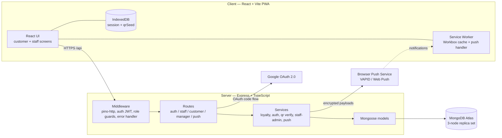

# BrewPoints — architecture overview

## Design patterns applied (rubric: design patterns & code quality)
- **Layered architecture** — routes (HTTP) → services (business logic) → models (data). Keeps the
  loyalty rules testable in isolation and swappable behind stable function signatures.
- **Repository/Data-Mapper** — Mongoose models encapsulate persistence; services never build queries
  inline beyond their own concern.
- **Middleware (chain of responsibility)** — `pino-http`, `authenticate`, `requireRole`,
  `requireManager`, central error handler compose per route.
- **Strategy via `intent`** — one QR component + one scan endpoint route to earn vs redeem flows by
  the signed `intent` field (no server-side request state).
- **Singleton** — single Mongoose connection and single logger instance shared process-wide.
- **Fail-fast configuration** — typed config validated at startup (`config.ts`).
