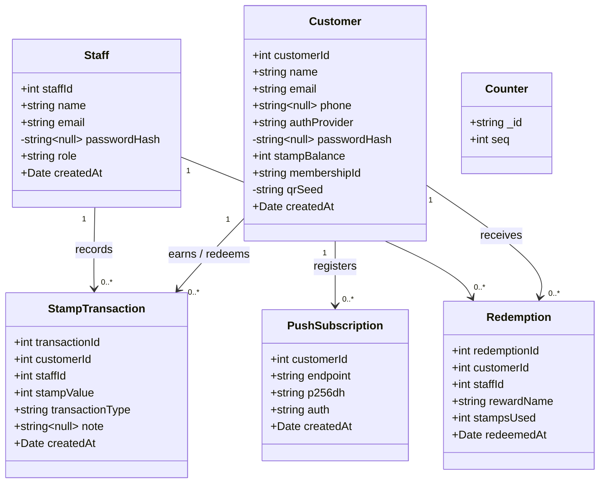

# BrewPoints — UML Class Diagram (domain model)

Reverse-engineered from `server/src/db.ts` (Mongoose models). Private (`-`) fields are server-only
secrets that never leave the backend in any API payload (red line R3). Integer surrogate keys
(`customerId`, `staffId`, …) are allocated from the `Counter` collection.

## Notes
- **R2 (source of truth):** `StampTransaction` is the authoritative ledger; `Customer.stampBalance`
  is a derived cache. `transactionType ∈ {Earn, Redeem, Adjustment}`, `stampValue` is signed
  (+1/+2 earn, −10 redeem).
- **R3 (offline QR):** `qrSeed` is the per-customer HMAC key — stored only here, never in a QR payload.
- **Append-only ledger:** transactions are created and read, never updated/deleted (audit integrity).
