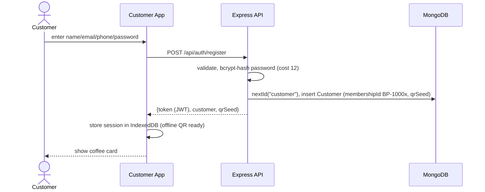
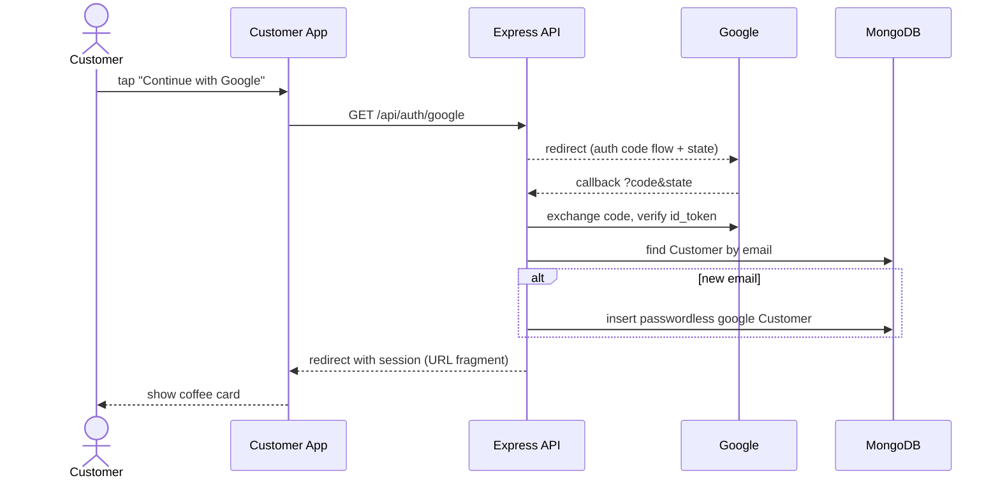
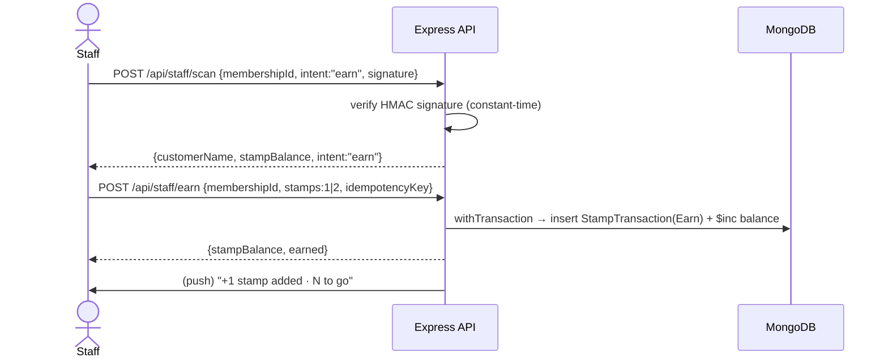

# Sequence — authentication & earning stamps

## A. Register / login (email + password)

```mermaid
sequenceDiagram
    actor Customer
    participant App as Customer App
    participant API as Express API
    participant DB as MongoDB

    Customer->>App: enter name/email/phone/password
    App->>API: POST /api/auth/register
    API->>API: validate, bcrypt-hash password (cost 12)
    API->>DB: nextId("customer"), insert Customer (membershipId BP-1000x, qrSeed)
    API-->>App: {token (JWT), customer, qrSeed}
    App->>App: store session in IndexedDB (offline QR ready)
    App-->>Customer: show coffee card
```

## B. Google OAuth (same button = signup or login)

```mermaid
sequenceDiagram
    actor Customer
    participant App as Customer App
    participant API as Express API
    participant Google
    participant DB as MongoDB

    Customer->>App: tap "Continue with Google"
    App->>API: GET /api/auth/google
    API-->>Google: redirect (auth code flow + state)
    Google-->>API: callback ?code&state
    API->>Google: exchange code, verify id_token
    API->>DB: find Customer by email
    alt new email
        API->>DB: insert passwordless google Customer
    end
    API-->>App: redirect with session (URL fragment)
    App-->>Customer: show coffee card
```

## C. Earn a stamp (staff scans member code)

```mermaid
sequenceDiagram
    actor Staff
    participant API as Express API
    participant DB as MongoDB

    Staff->>API: POST /api/staff/scan {membershipId, intent:"earn", signature}
    API->>API: verify HMAC signature (constant-time)
    API-->>Staff: {customerName, stampBalance, intent:"earn"}
    Staff->>API: POST /api/staff/earn {membershipId, stamps:1|2, idempotencyKey}
    API->>DB: withTransaction → insert StampTransaction(Earn) + $inc balance
    API-->>Staff: {stampBalance, earned}
    API->>Staff: (push) "+1 stamp added · N to go"
```
