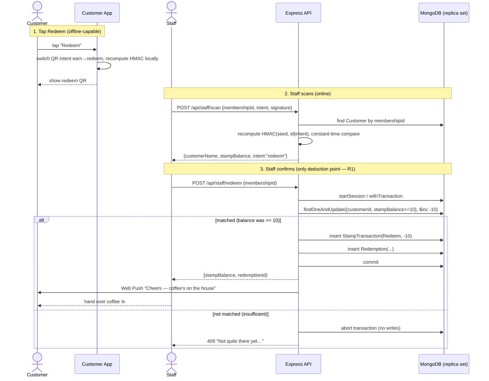

# Sequence — redeem a free coffee (one-stage, R1/R2)

The only place stamps are deducted (R1: staff confirmation). The deduction + Redeem transaction +
Redemption record commit in one MongoDB transaction with an atomic conditional update (R2), so
concurrent confirms can never drive the balance negative.

